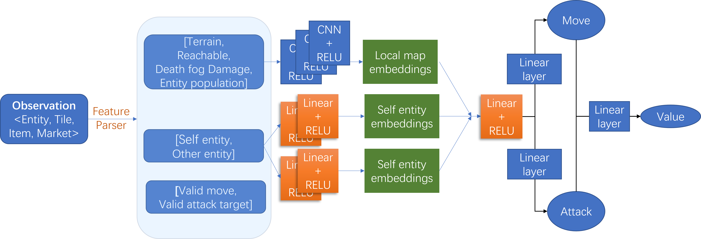
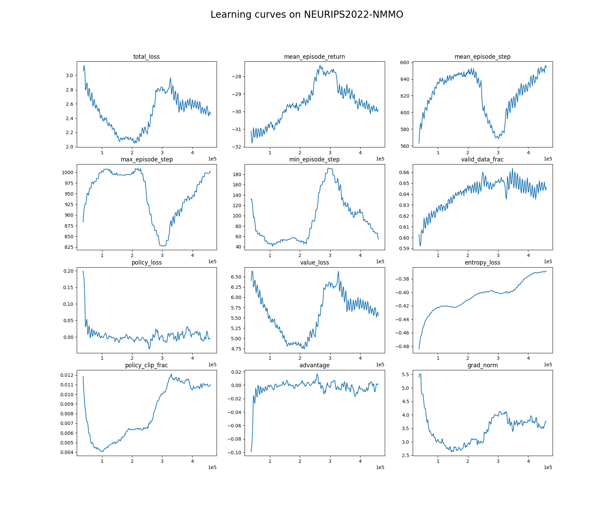

# NMMO Competition

# 1. feature parser

This is provide by the baseline, and it parses the observations to a read and use friendly data struct. An agent can only observe a $$15*15$$ tiles around it self. 

|                   | explanation                                                  | low  | high | shape | data type            |
| :---------------: | ------------------------------------------------------------ | ---- | ---- | ----- | -------------------- |
|      terrain      | the terrain of each tile around the agent.                   | 0    | 15   | 15x15 | integer              |
|     reachable     | If the tile around the agent is reachable.                   | 0    | 1    | 15x15 | bool(but use float ) |
| death_fog_damage  | The death fog damage of each tiles around the corner.        | 0    | 1    | 15x15 | float                |
| entity_population | Different population type of agents.                         | 0    | 5    | 15x15 | integer              |
|    self_entity    | The information of agent self.                               | 0    | 1    | 1x26  | float                |
|   other_entity    | The information of other agents.                             | 0    | 1    | 15x26 | float                |
|      va_move      | Whether the agent can stay or move up, down, left, or right. | 0    | 1    | 5     | bool                 |
| va_attack_target  | Whether the coordination in the attack range of the agent can be attacked. | 0    | 1    | 16    | bool                 |

And for ```self_entity``` and `other_entity` above, they both have 26 columns for each row, and the details about the 26 columns are as below. They have been scaled to 0~1.

|               |                                           |                   |               |
| :-----------: | :---------------------------------------: | :---------------: | :-----------: |
|   attacked    |                   level                   |    item level     |      row      |
|      col      |               row to center               |   col to center   | damage taken  |
|  alive time   |                   gold                    |      health       |     food      |
|     water     |                melee level                |    range level    |  mage level   |
| fishing level |              herbalism level              | prospecting level | carving level |
| alchemy level | population information(5 column features) |                   |               |

There are also a data structure named ```Metrics``` that can be used to collect the information of an agent:

Note: the information collected is cumulative data.

|                   |                 |                   |                  |               |                 |
| :---------------: | :-------------: | ----------------- | ---------------- | ------------- | --------------- |
|  player defeats   |   time alive    | damage taken      | profession       | melee level   | range level     |
|   fishing level   | herbalism level | prospecting level | carving level    | alchemy level | hat level       |
|     top level     |  bottom level   | held level        | ammunition level | melee attack  | range attack    |
|    mage attack    |  melee defense  | range defense     | mage defense     | equipment     | ration consumed |
| poultice consumed |  ration level   | poultice level    | gold             | sells         | buys            |

# 2. reward parser

We tried to optimize the reward function and to tune the hyper-parameters to get stronger agents.

The final score is consist of two parts: alive score(up to 10) and defeats score(0.5*number of kills). 

## 2.1 Alive reward

Because we firstly want the agent to live as long as possible until 1024 steps end, we use a exponential function for the agent to get reward. So that the agent will get greater than but approximate to 0 reward in the steps range 1 to 1000, and get more and more when the steps be closer to 1024 (cumulative reward is 10). And we will also reward 5.0 to the agent when it is still alive when the step is 1024.

## 2.2 Obstacle reward

We don't want the agent to be stubbed in a corner that around obstacles, so we will reward the agent $$\frac{2}{1024}$$ point each step if there are no more than 3 obstacles around its 4 directions. So if the agent is alive in step 1024, it can gain 2 reward at most from this part.

## 2.3 Fog damage

After 200 steps, there will be death fog around the map, and we will reward the agent $$\frac{2}{1024}$$ each step if it doesn't stay in the fog, otherwise punish $$ \frac{100}{1024}*e^{(1-hp)*1+10*fog\_damage}$$ point penalty to the agent, where ```hp``` is the health of the agent scaled to 0~1, `fog_damage` is the damage the agent is suffering scaled to 0~1.

## 2.4 Team reward

We will reward the agent if there are more allies than enemies in its attack range.

## 2.5 Defeat reward

We will reward the agent $$2*kill*(\frac{1}{1+e^{-hp*5}}-0.5)*max(1,kill\_gained)$$, where `kill` is the number of defeats in last step, `kill_gained` is the total value the agent gained from the update defeat, scaled by dividing 10.

## 2.6 Profession reward

For each leveled up profession, the agent will be rewarded $0.1*(curr\_level-prev\_level)*curr\_level$.

## 2.7 Equipment reward

If the the agent get a higher level equipment, it will be reward $0.1*(curr\_level-prev\_level)*curr\_level$.

## 2.8 Damage taken penalty

If the agent's health is under 0.8 but it didn't defeats others in last step, punish a penalty to it: 

```python
(curr["DamageTaken"] - prev["DamageTaken"]) * 0.1
```

## 2.9 Starvation penalty

If the agent's food or water is under 0.5, punish a penalty:

```python
1.*(1/(1+math.exp(current_food*10))) # food penalty
# or
1.*(1/(1+math.exp(current_water*10))) # water penalty
```

## 2.10 death penalty

If the agent dead before all steps end, punish 2 points in each step.





